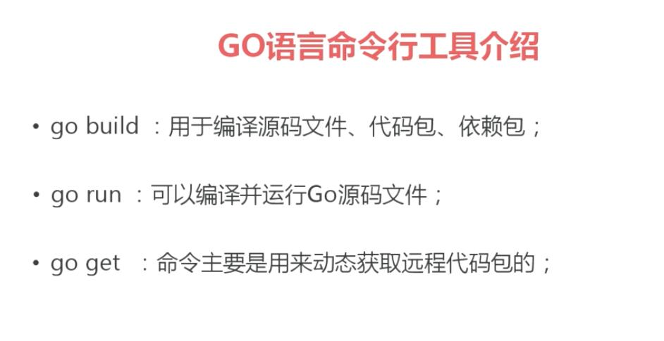

1.下载go语言环境包

https://golang.org/

2.编写第一个go语言

新建文件 test.go

```golang
package main

import "fmt"

func main() {
   fmt.Println("Hello, World!")
}
```

3.运行
```golang
go run test.go
```


4.生成二进制包
```golang
go build test.go

生成的二进制包可以直接在windows下运行

test.exe
```

